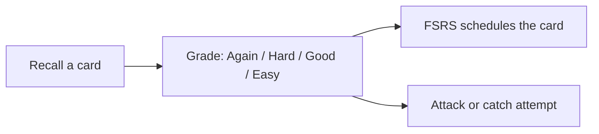
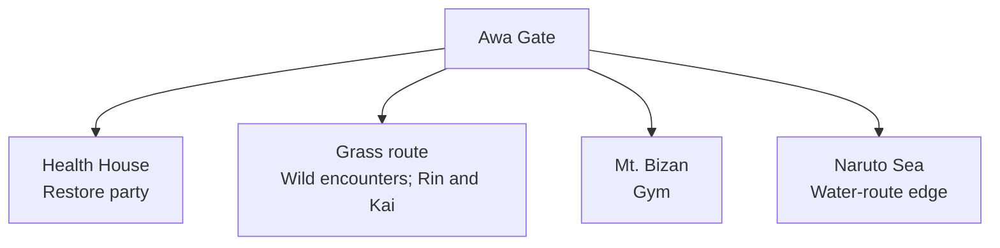
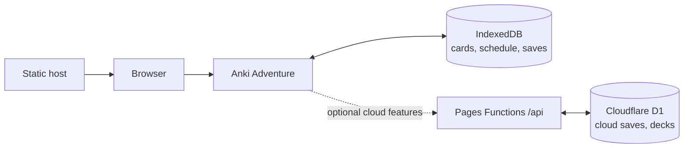

# Anki Adventure

A browser-based Japanese-vocabulary game inspired by handheld monster RPGs. Explore Awa Gate, meet original monsters, and turn each Anki review into a battle action.



## Play

- Move with arrow keys, WASD, or the on-screen D-pad.
- Press **A / Check** to interact, challenge trainers, or start a route battle.
- In battle, reveal the answer, grade your recall, then resolve the attack or catch attempt.

Wild monsters can be caught. Select **Catch instead** before grading to use that review for a catch attempt.

## Reviews and battles

### Scheduling

- Queue order: learning/relearning, reviews due today, then new cards.
- Counters show remaining new cards, learning/relearning cards due in the 20-minute window, and reviews due before the 04:00 local rollover.
- New cards have a permanent daily limit of 10 by default. **Increase today's limit by 5** is a temporary Custom Study override. Set the permanent limit to `0` for review-only study.
- Grading uses FSRS-6 with Anki defaults: 90% retention, 1m/10m learning steps, and a 10m relearning step.
- Trainer level is `1 + floor(mature cards / 20)`, capped at 100. A mature card is in review with an interval of at least 21 days.

### Battle grades

| Grade | Attack | Enemy attack |
| --- | ---: | --- |
| Again | 0.3× | Normal damage |
| Hard | 0.5× | 0.7× damage |
| Good | 1.0× | Guarded |
| Easy | 1.5× | Guarded |

```text
max HP        = base HP + 10 × level
base power    = base power + 2 × level
player damage = round(base power × grade multiplier)
enemy damage  = max(1, round(enemy base power × 0.75 × grade defense))
```

Grade defense is 1.0× for Again, 0.7× for Hard, and 0 for Good or Easy. Enemy level is selected from the living party's lowest level through its highest level plus five. Mt. Bizan unlocks at trainer level 8 and has three monsters.

### Catching and party

- Catch chances: 5%, 15%, 35%, and 55% for Again through Easy; lower when the target has more HP.
- A party holds six monsters; overflow goes to a 100-monster box.
- Use the **☰ pack** menu to manage the party. At least one monster must remain in it.
- Victories grant active monsters Medium Fast (`level³`) XP. HP carries between battles; the Health House restores the party.

## World and monsters

**Awa Gate** is a stylized, non-geographic Awaji–Tokushima setting.



| Monster | Role | Base HP / Power |
| --- | --- | ---: |
| Tanukiwi | Tanuki-inspired balanced starter | 29 / 9 |
| Uzumi | Naruto-water wild monster | 24 / 12 |
| Mosslug | Durable Mt. Bizan wild monster | 38 / 6 |
| Awaflash | Fast Tokushima-route wild monster | 19 / 15 |

All art is original runtime pixel-style art. See [map research](docs/map-research.md) for the public references behind the setting.

## Decks and backups

Open the **☰ pack** menu to import CSV or Anki `.apkg` files.

- CSV columns: `front,back,reading`; header optional.
- APKG files are parsed in the browser. Supported fields include word/front, meaning/back, reading, furigana, example sentence, and sentence meaning.
- Matching card IDs are added or replaced. Use a fresh browser profile for a clean game.
- **Export backup** downloads cards and the player save as JSON; **Restore backup** imports it on the same device.

Game data, imported media, and scheduling state live in this browser's IndexedDB. Browser storage can be cleared, so keep backups—especially on iOS.

## Architecture

Ordinary play is local-first and needs no backend. Cloud saves and curated decks are optional.



Vite produces `dist/`, deployable to any static host. Cloud mode uses Cloudflare Pages Functions and D1; local game data stays in IndexedDB.

## Stack

| Area | Choice |
| --- | --- |
| Rendering | Phaser 3.90 + Canvas |
| App | TypeScript + Vite |
| Scheduling | `ts-fsrs` |
| Storage | Dexie + IndexedDB |
| Deck import | JSZip + sql.js |
| Offline | Web manifest + service worker |
| Tests | Vitest + fake IndexedDB |

Import support is lazy-loaded, so SQLite parsing is excluded from the initial playable map. Application JavaScript is about 377 KB gzipped; the import-only SQLite WebAssembly payload is about 323 KB gzipped.

## Development

Requires Node.js 20+ and npm.

```bash
npm install
npm run dev
```

`dev` runs Vite plus the local Pages Functions/D1 server. Use `npm run dev:app` or `npm run dev:db` to run either separately. `dev:db` applies local migrations; after adding a migration, run `npm run d1:migrate:local` with the server stopped.

### Check and deploy

```bash
npm test
npm run build
npm run dev:cloud # local built-app + Functions smoke test
npm run deploy    # production D1 migration + Pages deployment
```

- `npm run preview` serves an existing frontend build.
- `npm run deploy:db` migrates production D1 only.
- `npm run deploy:app` builds and deploys the Pages app only.
- A local-first deployment needs only `dist/`; deploy it to Cloudflare Pages, Vercel, Netlify, or another static host.
- For optional cloud persistence, use the [Cloudflare deployment runbook](docs/cloud-persistence.md).
